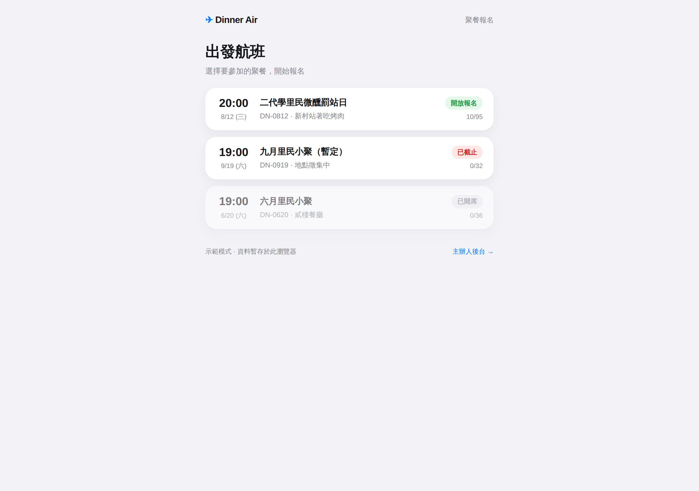
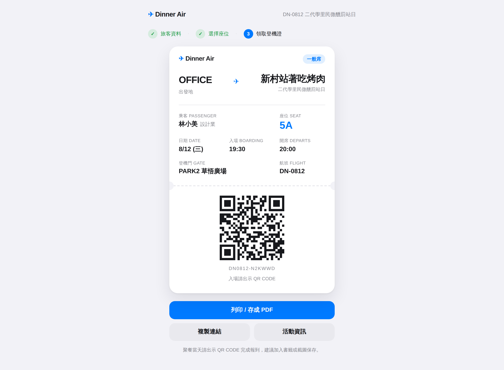
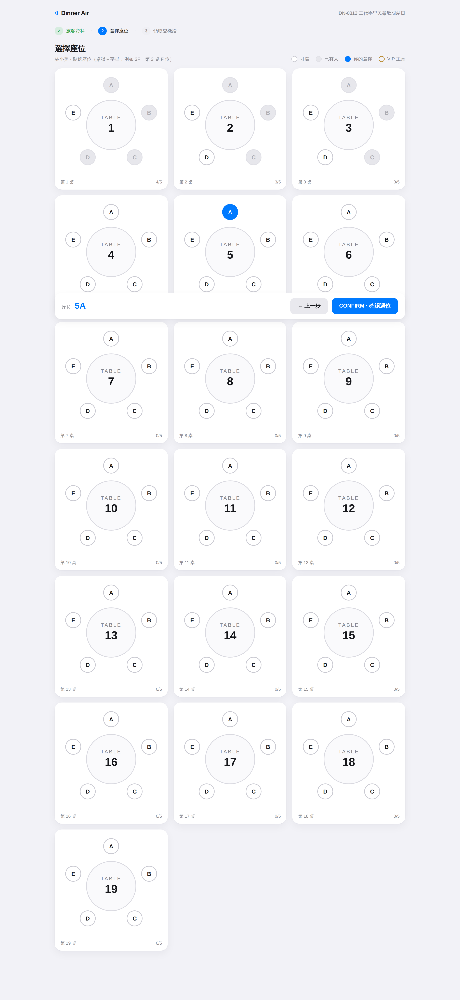
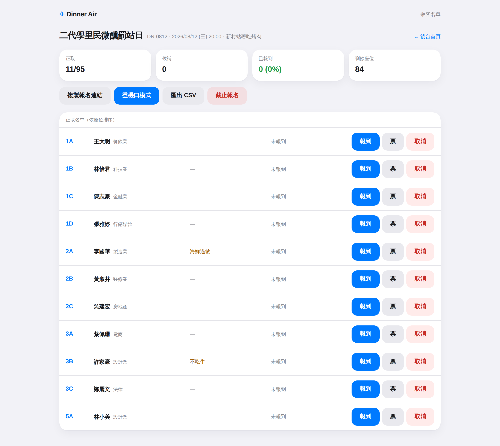

# ✈ Dinner Air — 聚餐報名系統

把公司／社團聚餐包裝成一趟航班的報名系統：**航班列表 → 櫃檯報名 → 圓桌選位 → 領登機證 → 當天 QR 掃描登機**。
視覺走 **Apple Wallet 票卡風**：亮色、大留白、卡片式、系統字體。

| 航班列表 | 登機證 |
|---|---|
|  |  |

| 圓桌選位 | 乘客名單（後台） |
|---|---|
|  |  |

## 概念對應

| 航空世界 | 聚餐系統 |
|---|---|
| 航班編號 `DN-0808` | 一場聚餐活動 |
| 出發時間 / 登機時間 | 開席時間 / 建議入場時間 |
| 目的地・登機門 | 餐廳・樓層/包廂 |
| 艙等 | 一般席 / VIP 主桌 |
| 座位 `3F` | 第 3 桌 F 位（桌號＋字母，跳過 I/O） |
| 登機證＋QR | 報名成功憑證，當天入場出示 |
| 登機 Boarding | 當天報到（掃 QR 或名單勾選） |
| 候補 Standby | 滿員後的候補名單，可依序遞補 |

## 快速開始

```bash
npm install
npm run dev        # http://localhost:3000
```

- **示範登機證**：`/pass/DN0812-DEMO01`
- **主辦人後台**：`/admin`，示範通關碼 `0815`（可用環境變數 `NEXT_PUBLIC_ADMIN_CODE` 更換）
- **重置示範資料**：後台最下方 RESET DEMO DATA

### 冒煙測試

```bash
npm run build && npm run start &   # 先起 server
npm run smoke                      # Playwright 跑完整報名流程並截圖到 ./smoke-shots
```

## 頁面地圖

| 路徑 | 說明 |
|---|---|
| `/` | 航班（活動）列表 |
| `/flight/[code]` | 航班資訊＋CHECK IN 入口 |
| `/flight/[code]/checkin` | 報到櫃檯：姓名、產業、備註（忌口） |
| `/flight/[code]/seat` | 圓桌選位圖（`?pass=<token>` 可為已報名者補選位） |
| `/pass/[token]` | 個人登機證：QR、列印、已登機蓋章 |
| `/admin` | 航務後台：開航班（桌數×每桌座位、VIP 主桌）、截止/重開 |
| `/admin/[code]` | 乘客名單：統計、遞補、取消、匯出 CSV |
| `/admin/[code]/boarding` | 登機口：QR 掃描報到＋手動名單備援 |

## 架構（Phase 1：前端原型）

- **Next.js 16（App Router）＋ Tailwind CSS v4**，系統字體（SF Pro／PingFang／Noto Sans TC），設計 token 集中在 `globals.css` 的 `@theme`
- **資料層 `src/lib/store.ts`**：目前存瀏覽器 localStorage（跨分頁即時同步），**所有 UI 只透過這個模組的 API 存取資料**
- QR 產生 `react-qr-code`、掃描 `qr-scanner`（登機口相機需 HTTPS 或 localhost）

```
src/
  lib/        types.ts（資料模型）· seed.ts（示範資料）· store.ts（mock 資料層）· client.ts · format.ts
  components/ Chrome · StepBar · BoardingPass · SeatMap · QrScan · AdminGate
  app/        （頁面，見上表）
```

### 資料模型

```ts
Flight   { id, code, title, departAt, endAt?, boardingMinutes, origin,
           venueName, venueAddress, gate, tables: {label, seats, vip?}[], status, notes }
Attendee { id, flightId, name, industry?, note?, seat?,
           status: confirmed|standby|cancelled, checkedInAt?, passToken }
```

## Phase 2：接 Supabase（規劃）

Phase 1 的 localStorage 只是替身——**換掉 `store.ts` 的實作即可**，UI 不用動：

1. Supabase 建 `flights`、`attendees` 兩張表（欄位同上），`attendees(flight_id, seat)` 加 **unique 約束**擋選位撞位
2. `store.ts` 改為 supabase-js 呼叫；名單/座位圖訂閱 **Realtime** 取代 storage event
3. 後台改用 **Supabase Auth**（取代 `NEXT_PUBLIC_ADMIN_CODE`），RLS：公開可讀航班／建立報名，僅主辦人可改他人資料
4. 部署 Vercel，環境變數 `NEXT_PUBLIC_SUPABASE_URL`、`NEXT_PUBLIC_SUPABASE_ANON_KEY`

之後可再加：Email/行事曆邀請、報名截止倒數、多主辦人、桌次拖拉調整。
